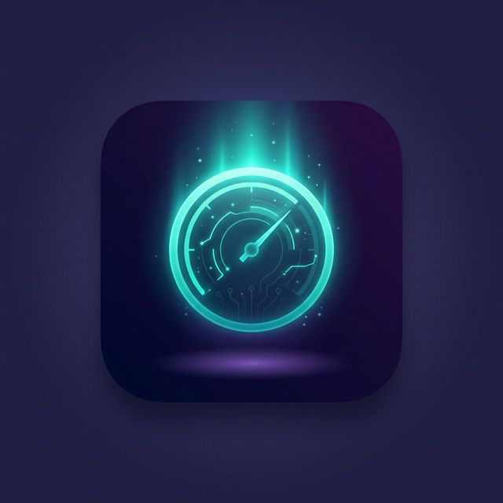
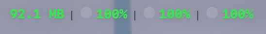
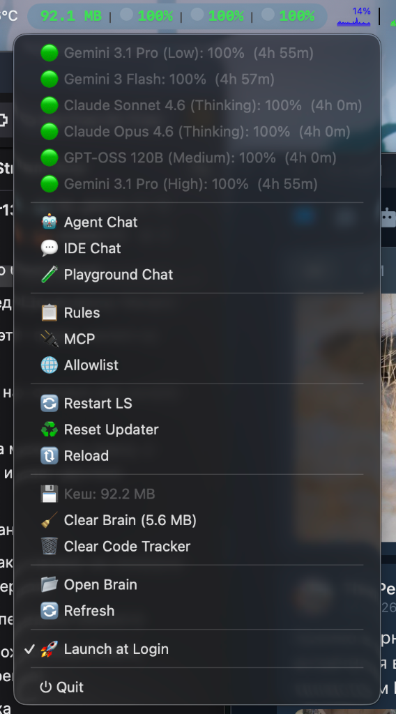

# 🚀 Antigravity Stats

<p align="center">
  
</p>

<p align="center">
  <strong>macOS menu bar companion for Antigravity IDE</strong><br>
  Monitor quota usage, cache size, and access quick actions — all from your menu bar.
</p>

<p align="center">
  
  
  
</p>

---

## ✨ Features

| Feature | Description |
|---------|-------------|
| 📊 **Quota Indicators** | Flash, Pro, Claude — color-coded percentages |
| ⏱ **Timer Circles** | Pie-fill showing time until quota reset |
| 💾 **Cache Size** | Colored by thresholds (🟢 <100MB, 🟡 <300MB, 🟠 <500MB, 🔴 >500MB) |
| 🔌 **Quick Actions** | Rules, MCP, Allowlist, Restart LS, Reset Updater, Reload |
| 🧹 **Cleanup** | Clear Brain & Code Tracker with confirmation |
| 💬 **New Chat** | Launch new Antigravity chat from menu |
| 🧪 **Playground** | Open playground directory |
| 🚀 **Launch at Login** | Toggle auto-start |
| 🔴 **Offline Detection** | Shows "OFF" when daemon is not running |

## 📸 Preview

**Menu Bar:**



**Context Menu:**



## 📥 Install

### From Source

```bash
git clone https://github.com/helgklaizar/antigravity-stats.git
cd antigravity-stats
chmod +x build-app.sh
./build-app.sh
cp -r "Antigravity Stats.app" /Applications/
```

### Quick Run (Development)

```bash
swift build
.build/debug/StellarBar
```

## 🔧 Requirements

- **macOS 13.0+** (Ventura)
- **Antigravity IDE** installed and running
- **Swift 6.0+** toolchain (for building from source)

## 🏗 Architecture

```
┌─────────────────────────────────────────────────┐
│                 Menu Bar                         │
│  77.6 MB  |  ◐ 100%  |  ◐ 100%  |  ◑ 40%      │
└──────────────────┬──────────────────────────────┘
                   │ click
┌──────────────────▼──────────────────────────────┐
│              Context Menu                        │
│  ├─ Quota details (per model)                   │
│  ├─ New Chat / Playground                       │
│  ├─ Rules / MCP / Allowlist                     │
│  ├─ Restart LS / Reset Updater / Reload         │
│  ├─ Clear Brain / Code Tracker                  │
│  ├─ Launch at Login toggle                      │
│  └─ Quit                                        │
└──────────────────┬──────────────────────────────┘
                   │
┌──────────────────▼──────────────────────────────┐
│          AntigravityAPI                          │
│  ├─ Daemon discovery (~/.gemini/antigravity/)   │
│  ├─ Connect/Protobuf quota fetch                │
│  └─ Cache size calculation                      │
└─────────────────────────────────────────────────┘
```

## 🔌 How It Works

1. **Daemon Discovery** — reads JSON files from `~/.gemini/antigravity/daemon/` to find the active Language Server
2. **Quota Fetch** — sends `GetUserStatus` request via Connect protocol to the local HTTP port
3. **Polling** — refreshes data every 30 seconds
4. **Cache Calculation** — sums `brain/` and `conversations/` directory sizes

## 📁 Project Structure

```
├── Package.swift                    # Swift Package Manager manifest
├── build-app.sh                     # .app bundle builder
├── Sources/AntigravityStats/
│   ├── main.swift                   # Entry point
│   ├── AppDelegate.swift            # Menu bar UI & actions
│   ├── AntigravityAPI.swift         # Daemon API & utilities
│   └── Resources/
│       ├── Info.plist               # App metadata
│       └── AppIcon.icns             # App icon
```

## 📄 License

MIT — see [LICENSE](LICENSE)

---

<p align="center">
  Made with ⚡ for the Antigravity community
</p>
